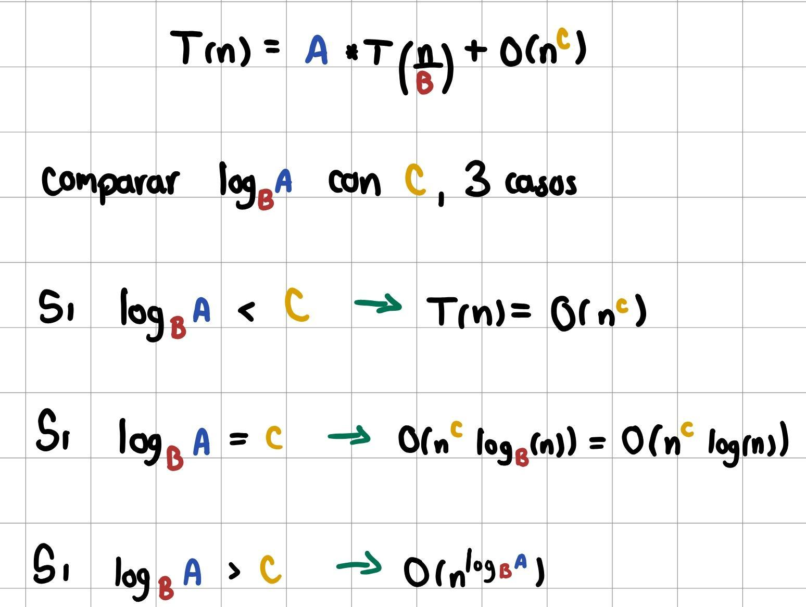
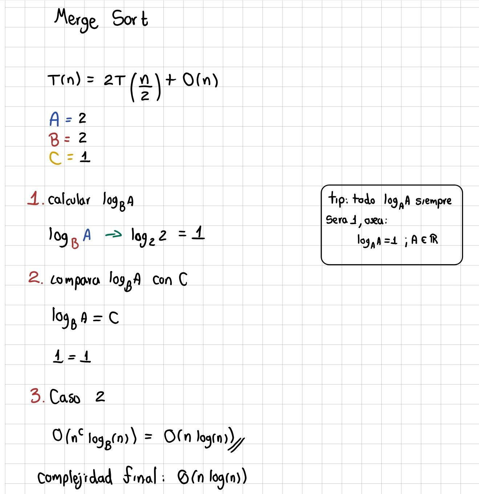

# Teorema Maestro

El **Teorema Maestro** es una herramienta matemática que permite calcular de forma directa la complejidad temporal de algoritmos recursivos, especialmente aquellos basados en el paradigma de [Dividir y conquistar](https://github.com/JDavid-Moreno/Dividir-y-conquistar.git). Su propósito es resolver ecuaciones de recurrencia que siguen el siguiente patrón:

$$
T(n) = a T \left( \frac{n}{b} \right) + f(n)
$$

Este teorema evalúa la complejidad final analizando y comparando el costo de las llamadas recursivas frente al trabajo realizado fuera de ellas. En consecuencia, permite determinar directamente la notación Big O.

---

## Fórmula y significado de sus componentes

$$
T(n) = a T \left( \frac{n}{b} \right) + f(n)
$$

### Componente $a$
Representa la **cantidad de subproblemas** que se generan en cada nivel de recursión (es decir, el número de llamadas recursivas). Por ejemplo, en el algoritmo [Merge Sort](https://github.com/JDavid-Moreno/Algoritmos-de-ordenamiento/blob/main/Algoritmos/Merge/MergeSort.py), la lista se divide en dos partes iguales y se vuelve a llamar el método recursivo para cada una de ellas; por lo tanto, su cantidad de subproblemas es $a = 2$.

### Componente $b$
Representa el **factor de división** del problema; en otras palabras, es el factor por el cual se reduce el tamaño del argumento en cada nivel. Por ejemplo, si el problema se divide a la mitad, entonces $b = 2$; si se divide en tres partes, $b = 3$, y así sucesivamente. Para garantizar la reducción del problema, se necesita que $b > 1$.

### Componente $f(n)$
Representa el **costo del trabajo realizado fuera de las llamadas recursivas**. Esto incluye el tiempo invertido en las fases de división del problema y combinación de resultados, como la ejecución de ciclos, condicionales y operaciones elementales.

---

## Cómo calcular la complejidad a partir de la ecuación

Para determinar la complejidad mediante este método, partimos de la ecuación base:

$$
T(n) = a T \left(\frac{n}{b} \right) + f(n)
$$

Primero se deben identificar los valores numéricos de $a$ y $b$. El término $f(n)$, que representa el trabajo extra, se expresa generalmente como $O(n^c)$, donde $c$ es el exponente que analizáremos. De este modo, la estructura de la fórmula quedará de la siguiente manera:

$$
T(n) = {\color{red}a} T \left( \frac{n}{{\color{red}b}} \right) + O(n^{\color{red}c})
$$

Una vez definidos estos parámetros, se comparan los valores para determinar cuál de los tres casos del teorema se aplica:



En la imagen anterior se observan los tres escenarios posibles para deducir la complejidad. El análisis se reduce a comparar matemáticamente el valor de $\log_b(a)$ con el exponente $c$:

1. Si $\log_b(a) > c$, el costo está dominado por las llamadas recursivas.
2. Si $\log_b(a) = c$, existe un equilibrio entre el trabajo recursivo y el trabajo local.
3. Si $\log_b(a) < c$, el costo está dominado por el trabajo fuera de la recursión.

### Ejemplo con Merge Sort

Sabemos de antemano que la complejidad de Merge Sort es $O(n \log n)$. A continuación, validaremos este resultado aplicando el Teorema Maestro.

**NOTA:** Para este ejemplo, utilizaremos la ecuación de recurrencia ya establecida para Merge Sort. El proceso detallado para construir esta ecuación a partir del código se explicará más adelante.



Como se puede observar, el cálculo nos conduce exactamente a la complejidad real de Merge Sort $O(n \log n)$. Esto demuestra la efectividad del método, el cual puede aplicarse a cualquier algoritmo recursivo cuya estructura se ajuste a la del teorema.

---

## Cómo construir la ecuación de recurrencia

Es importante aclarar que no todos los algoritmos recursivos pueden ser evaluados con esta herramienta. El Teorema Maestro únicamente funciona con los algoritmos que cumplen la estructura. 

Para construir la ecuación, debemos analizar paso a paso cada uno de los elementos que componen el teorema, es decir, $a$, $b$ y $f(n)$, ver donde se encuentran y pues es su respectivo valor, para que se logre entender de mejor manera, hagamos un ejemplo con merge sort, ya que es de los más sencillos de entender.

### Código merge sort y análisis para teorema maestro

``` 
def merge(array):
    if len(array) == 1:
        return array
    half = len(array) // 2
    left = array[:half]
    right = array[half:]

    sorted_left = merge(left)
    sorted_right = merge(right)

    return merge_sort(sorted_left, sorted_right)

def merge_sort(left, right):
    array_sort = []
    while len(left) > 0 and len(right):
        if left[0] > right[0]:
            array_sort.append(right[0])
            right.pop(0)
        else:
            array_sort.append(left[0])
            left.pop(0)

    while len(left) > 0:
        array_sort.append(left[0])
        left.pop(0)
    while len(right) > 0:
        array_sort.append(right[0])
        right.pop(0)

    return array_sort
```

Este es el código general de merge sort, entonces vamos a desenlosarlo.

Primero vemos que se realizan dos llamadas recursivas.

``` 
sorted_left = merge(left)
sorted_right = merge(right)
``` 
O sea dividimos el problema en dos subproblemas, por lo que $ a = 2 $.

Y cada subproblema en vez de trabajar con el problema original, este trabaja con la mitad del problema, es decir, en vez de trabajar con los $n$ elementos, cada subtarea trabaja con $ \frac{n}{2} $, o sea, la mitad de los elementos, por lo que $ b = 2 $.

Ahora, para calcular $f(n)$ tenemos que revisar lo demás que no sea la recursión, en este caso está en la función `merge_sort` se realiza un ciclo completo,ya que:

```
while len(left) > 0 and len(right):
    if left[0] > right[0]:
        array_sort.append(right[0])
        right.pop(0)
    else:
        array_sort.append(left[0])
        left.pop(0)

while len(left) > 0:
    array_sort.append(left[0])
    left.pop(0)
while len(right) > 0:
    array_sort.append(right[0])
    right.pop(0)
```

Aca lo que sucede es que una vez que la recursion finalizo que es cuando todos los elementos quedaron totalmente separados, o sea se pasó de una lista de `n` elementos a `n` listas de un solo elemento. 

Se procede a juntar todos esos `n` elementos nuevamente pero de manera ordenada, por lo que aquí los `while` son de complejidad `O(n)` ya que al juntar todos los elementos en una unica lista, estos tienen que recorrerlos todos, auque no los recorren de manera tradicional que es iterando uno por uno, sino que lo que hacen es revisar el primer elemento e irlo borrando para agregarlo a una nueva lista, por lo que como tiene que eliminar todos los elementos, por lo que a su vez evaluo los `n`elementos, lo que da esa complejidad. 

Por lo que se concluye que: $ f(n) = O(n) $ 

Una vez con todos los valores encontrados, únicamente debemos reemplazarlos en la ecuación, lo cual nos pasa de esto:

$$
T(n) = a T \left(\frac{n}{b} \right) + f(n)
$$

A esto:

$$
T(n) = 2 T \left(\frac{n}{2} \right) + O(n)
$$

El cual es la forma de teorema maestro de merge sort, por lo que está correcto.

---

## Material adicional

[](https://www.youtube.com/watch?v=VplAn4NHYA0&t=209s)

[](https://www.youtube.com/watch?v=23-fTvd2qqs)

[](https://www.youtube.com/watch?v=SLsHKh_OUEM&t=3s)
